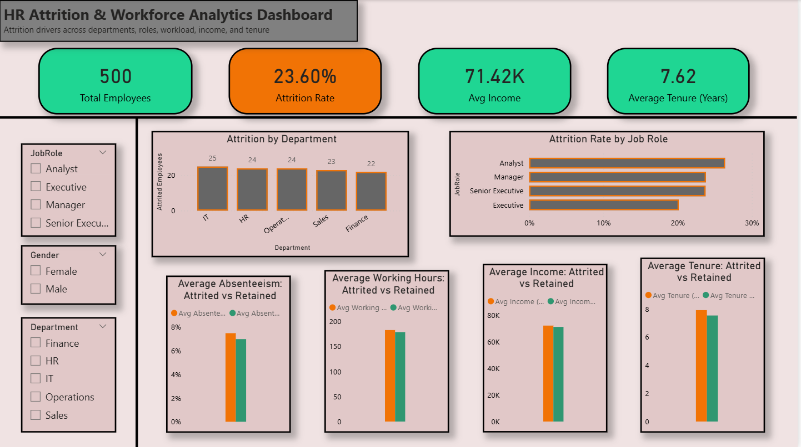

# HR Attrition & Workforce Analytics Dashboard (Power BI)

## Project Overview

This project focuses on analyzing employee attrition patterns and workforce behavior using Power BI.  
The goal was to identify key factors contributing to attrition and present insights in a clear, decision-ready dashboard suitable for HR and business stakeholders.

## Key Questions Answered

- Which departments and job roles experience higher attrition?
- How do income, tenure, absenteeism, and working hours differ between attrited and retained employees?
- What workforce patterns may indicate higher attrition risk?

## Tools & Skills Used

- Power BI
- DAX (calculated measures and KPIs)
- Data Modeling
- Data Cleaning & Transformation
- Exploratory Data Analysis
- Business Insight Communication

## Key Insights

- Attrition rates vary significantly across departments and job roles.
- Employees with higher absenteeism and longer working hours show higher attrition tendencies.
- Lower income levels and shorter tenure are commonly associated with employee exits.

## Intended Use

This dashboard is designed for HR teams and business managers to explore attrition patterns and identify workforce areas that may require attention or intervention.

## How to Use the Dashboard

Use the slicers (Department, Job Role, Gender) to filter the visuals and interactively explore attrition trends across different employee groups.

## Project Files

- `HR_Attrition_Dashboard.pbix` – Interactive Power BI dashboard
- `HR_Attrition_dashboard_preview.png` – Dashboard snapshot
- `dataset/` – Source CSV files used for analysis
